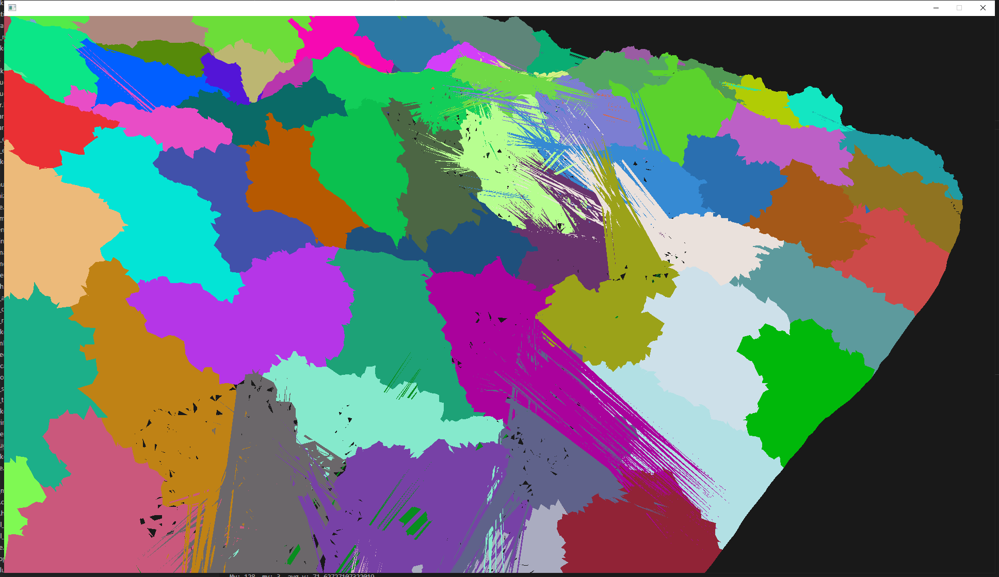
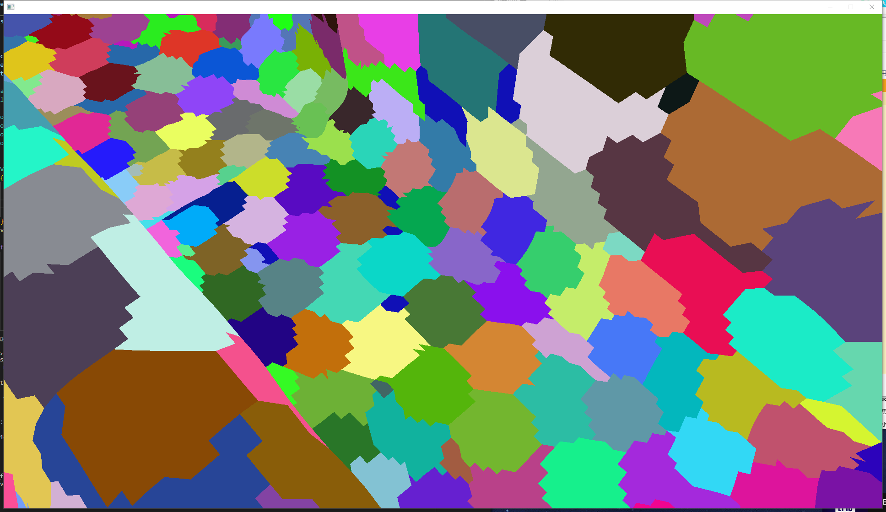
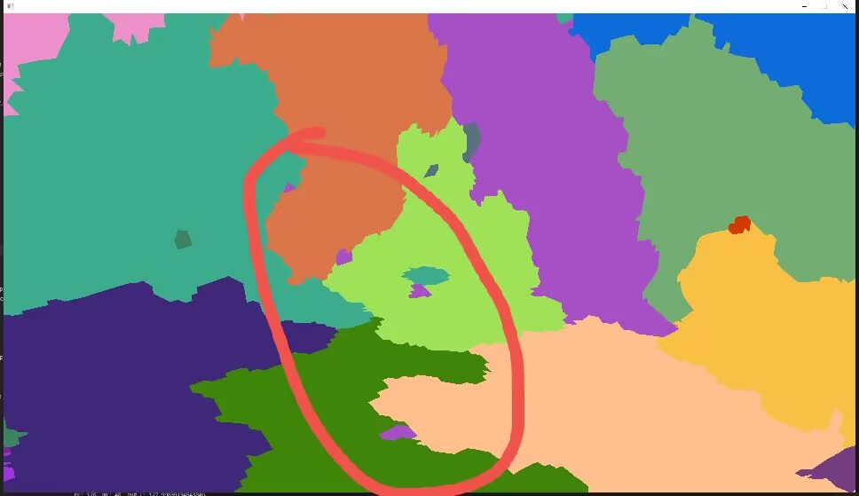
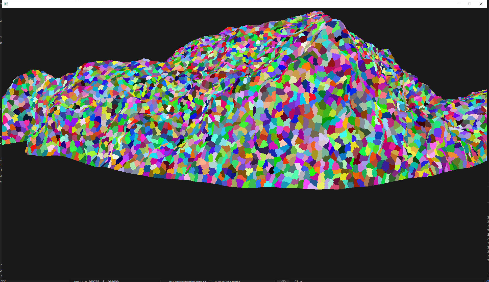

# learn-nrc

## upd 2024-2-17

实现gpu sort过程中遇到十分不理解的问题，打算更新系统和驱动，先将实现了的部分放上来备份

### virtual mesh

### mesh simplify 网格简化

最开始直接使用了 mesh-optimizer 的网格简化，但他的实现是一次取多条边直接简化，并不是误差最小的边  
这样会导致简化相当不均匀，并且在nanite的交替分组锁边中会选到相当差的边，如下图所示



所以自己实现

实现了带顶点属性的网格简化，并考虑了纹理接缝的处理（对纹理接缝边添加一个垂直平面的quadric）  
正确实现了属性的优化求解（ue实现中将不同wedge的面积相加后再构建矩阵的做法是错的）


实现了一个紧凑的网格数据结构，用于维护边坍塌过程中的各种操作  
主要结构有

| 顶点连接 | 对相同 position 但属性不同的顶点构建连接，用于wedge与纹理接缝等的判断 |
| ---- | ---- |
| unique_vert | 每个顶点一个下标，指向相同 position 的第一个出现位置 |
| vert_link | 相同 position 的顶点的环形链表，每个节点指向前一个相同 pos 的下标，第一个指向最后一个 |

| 顶点与面连接 | 顶点与面的连接（实际上是corner），用于寻找一个顶点相邻的面 |
| ---- | ---- |
| corner_head | 每个顶点一个下标，指向第一个以该顶点为corner的下标 |
| corner_link | 指向下一个相同顶点的corner |

| 边连接 | 每个边连接其反向边，用于判断边坍塌过程中的manifold，维护边坍塌过程中的edge id |
| ---- | ---- |
| opposite_edge | 每个边一个下标，其相反边 |
| edge_id | 每个边一个id，这条边与其相反边一个id为-1，一个id为正确id |


### partition 图划分

最开始因为后续需要在cluster dag上建bvh进行光追，所以想尽量让每个cluster尽可能空间分布上比较均匀（后面发现并不需要这样）  
所以最开始使用了 mesh-optimizer 的clustering  
但因为他是单纯贪心来划分，并且不保证cluster内的连续，所以会出现许多散落的小块，
如下图




这样会严重干扰后续对cluster的分组，导致相当多不该被锁的边  
如果强行将不连续的块分为新的cluster，会有很多不到十个三角形的小cluster，所以还是继续在ue的方案上修改

ue在 sig2021 talk 上说的图划分的trick在看实现之后发现是递归使用metis划分一个图为两部分，划分权重是 $[ \frac{(n / 126) / 2}{n / 126} , 1 - \frac{(n / 126) / 2}{n / 126}]$，这样可以尽可能让每个cluster的三角形数量接近 128  
上述方法在我的电脑上大网格会直接爆内存而速度爆慢  
研究了一下图划分的实现后发现图划分本身就有尽可能让块大小平均的处理，上述的方案相当于图划分过程中直接限制死了上层块的划分边界，反而对均匀划分不利  
目前的实现是以 124 为块大小直接让 metis 进行划分，随后再对大于 128 的块细分，这样在测试中 20000 cluster 的网格中只有 30 个左右的 cluster 会被再次划分，个人觉得还是相当不错的，并且也相当均匀



### draw indirect 间接绘制

在 lc 的 dx 后端简单写了个 draw indirect 的调用，能跑就行，lc-dx 代码相当混沌，后续换 rust 自己写一份

### gpu sort

因为 bvh 构建需要排序，需要实现 gpu sort  
目前理论最好的方法应该是使用了 decoupled-lookback scan 的 onesweep  
但 decoupled-lookback scan 中的关键操作是每个线程块等待前一个线程块的计算结果，这个操作在我的电脑上的 dx12 不能运行，网上找到的 [博客](https://raphlinus.github.io/gpu/2020/04/30/prefix-sum.html) 中提到这个算法在他的vulkan下能跑，但vulkan标准并不保证线程块的执行顺序

目前的实现是传统的 reduce-than-scan 的 radix-sort  
但在实现过程中遇到了十分费解的问题，见 `src/programs/test_sort/test_sort1.cpp`、`src/programs/test_sort/test_sort2.cpp`  
```cpp
Kernel1D block_sort = [&]($buffer<uint> keys, $buffer<uint> sorted_keys) {
    set_block_size(block_size);

    $uint tid = $thread_x;
    $uint bid = $block_x;

    $uint key = keys.read(tid + bid * block_size);

    $shared<uint> key_scratch{block_size};
    $shared<uint> scan_smem{block_size}; /// ??? smem size 设为 7 会出错

    for (uint p = 0; p < radix_bits; p += 2) {
        $uint digit = (key >> begin_bit) & (radix_digits - 1);
        $uint sub_d = (digit >> p) & 3;

        // block内计数一定小于256，用一个uint表示4个counter
        $uint pack_counter = 1 << (sub_d * 8);
        $uint block_sum = 0;
        block_exclusive_scan(pack_counter, pack_counter, block_sum, tid, scan_smem);

        // 将低位计数加到高位
        pack_counter += (block_sum << 8) + (block_sum << 16) + (block_sum << 24);

        $uint key_offset = (pack_counter >> (sub_d * 8)) & 0xff;

        // ??? 如果 shared memory 大小设置为 7 并且下两行出现，结果就会出错（上面的offset，block_sum计算都会错）
        key_scratch[key_offset] = key;
        sync_block();

        key = key_scratch[tid];
        sync_block();
    }
    sorted_keys.write(tid + bid * block_size, key);
};
```

上面代码是 test_sort2 错误的一个提取，对于 shared memory 大小和线程访问间有十分异常的情况  
test_sort1 中的 scatter kernel 有多个 shared 访问都会互相影响，本来以为是 lc-dx 生成代码出错，但检查后发现 codegen 没问题，目前暂时没找到解决方法